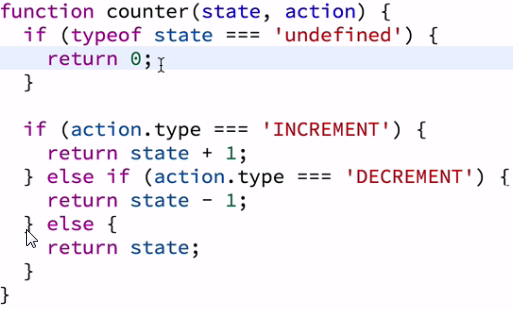
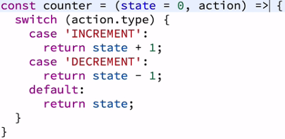
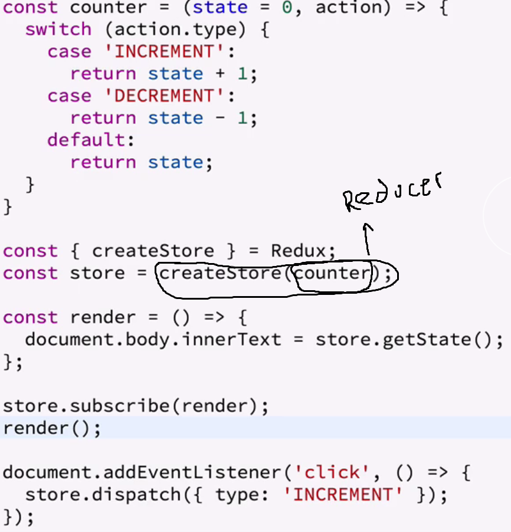

# ReactReduxIntro
Notes from: https://egghead.io/courses/getting-started-with-redux
To start: clone, cd into dir, npm install, npm run build, or npm run dev
-skipped video 9 (implementation of expect/deep freeze libraries)

1. Three Principles of Redux

    1. Everything is contained in a single JS object called the store or state tree. Every time a change is made, a new copy of that object is made with the appropriate changes

    2. The state is redundant, immutable. The only way that data is changed is by an action. An action is a javascript object with a minimum of a non-null (string recommended) ‘type’ property, which only contains the data that changed.

        1. Pure functions (some functions you write in redux have to be pure) - a function which return value depends solely on the values of their arguments, no observable side effects (network, db calls) if you call pure function with same set of arguments you get the same return value, and pure functions do not change the value of the variables passed to them, pure functions do not operate on the DOM.

    3. The Reducer function - takes the previous state of the app, action being dispatched, and returns the next state of the app and the function has to be pure. 

        2. The UI is a pure function of the application state

        3. If reducer function returns undefined state it must return what it considers to be the initial state of the application

        4. If reducer function is passed an action which it does not understand it should return the current state of the application

        5. Example reducer function:                               

2. The store binds together the three principles of redux ([see how to import redux](https://egghead.io/lessons/react-redux-store-methods-getstate-dispatch-and-subscribe)): holds the current application’s state object, lets you dispatch actions, when you create it need to specify the reducer. The store has three functions: getState() which returns the current state, dispatch() lets you dispatch actions to change state of action, subscribe() lets you register a callback that redux store will call any time an action has been dispatched so you can update UI to reflect current state. First working redux app:

in the above, the render is called after each time the store is updated. render() is called once to insert the initial state to innertext on load.

3. Mutations are not allowed in Redux.... From https://github.com/tastejs/todomvc/tree/gh-pages/examples/typescript-react: "Note: It's usually better to use immutable data structures since they're easier to reason about and React works very well with them. Use map(), filter() and reduce() everywhere instead of mutating the array or items themselves."
	-For objects use Object.assign() and ...spread
	-For arrays use concate(), slice(), and ...spread

